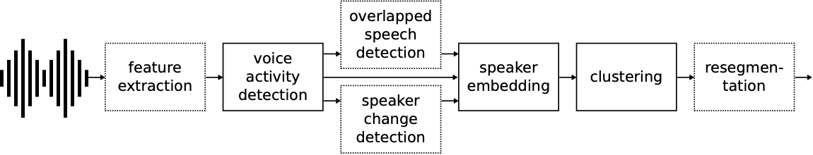
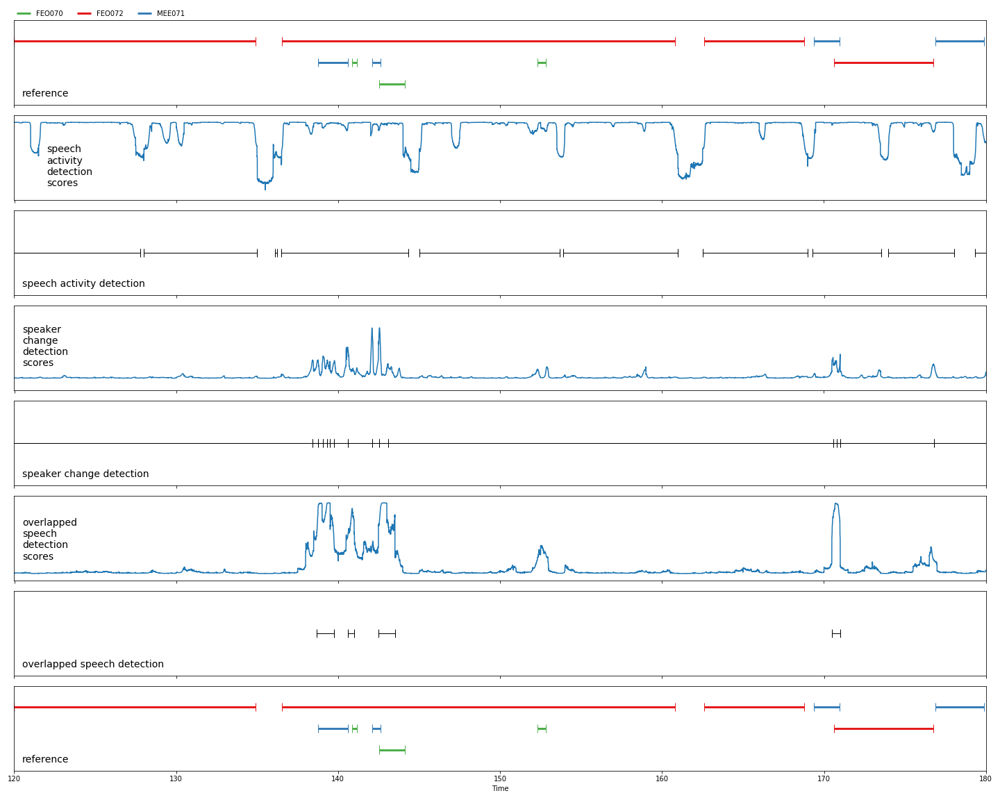

Neural Diarization Pipeline:




Neural Diarization Graphical Output:




## Installation

The base of hYdra id  `pyannote.audio` which only supports Python 3.7 (or later) on Linux and macOS. It might work on Windows but there is no garantee that it does, nor any plan to add official support for Windows.

The instructions below assume that `pytorch` has been installed using the instructions from https://pytorch.org.


```bash
$ pip install -r requirements.txt
$ pip install pyannote.audio==1.1.1
```

## How to Execute hyDra Neural Diarization Service and expose it as a Rest Url at port 9000.


```bash
$ ./run_hydra.sh
```

## Send Audio File to hyDra Rest Service for Diarizing a single audio and separate them into individual audio files corresponding to each speaker.

Copy an audio file i.e. example.wav that needs to be diarized to the example folder

```bash
$ mv example.wav asthma_1_1.wav
$ python3 example/send.py
```
The above command will send an audio to the diarization and service and diarize it.
